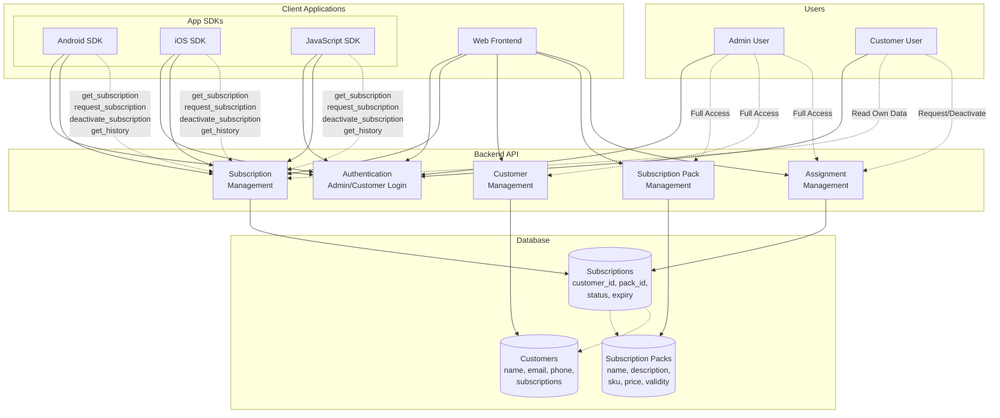
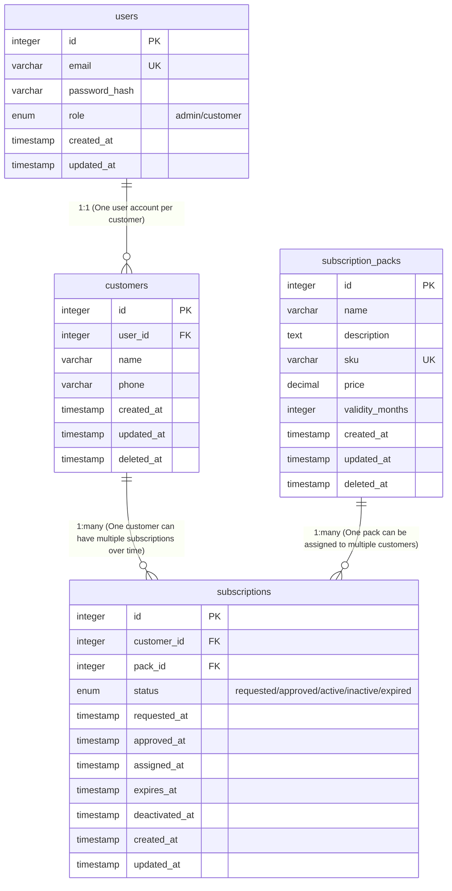
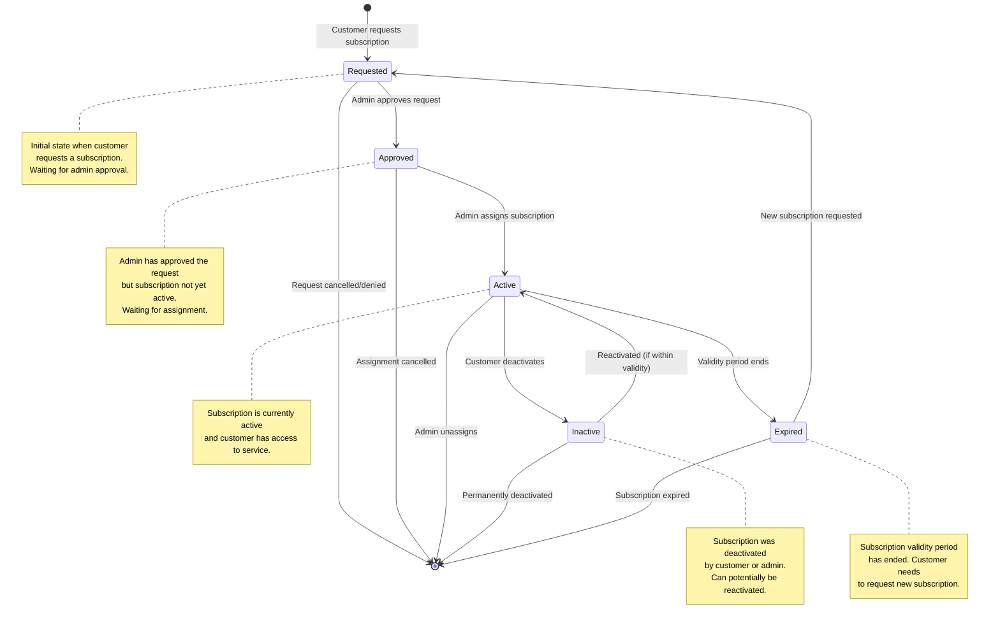

# Licence management system

## Core Components

### 1. User Management & Authentication

#### Admin Features
- **Login**: Admin authentication using email and password
- **System Administration**: Full access to manage customers, subscriptions, and assignments
- **Dashboard Access**: View system analytics, metrics, and recent activities

#### Customer Features
- **Registration**: Customer signup using email, password, name, and phone
- **Login**: Customer authentication using email and password
- **Profile Access**: View and manage own subscription details only
- **Self-Service**: Request new subscriptions and deactivate existing ones

### 2. Subscription Pack Management

#### Pack Attributes
- **Name**: Display name for the subscription plan
- **Description**: Detailed description of the plan features
- **SKU**: Unique identifier (hyphen-separated plan name)
- **Price**: Subscription cost (decimal format)
- **Validity Period**: Duration in months (1-12 months)

#### Operations
- **Create**: Add new subscription packs
- **List**: View all available subscription packs with pagination
- **Update**: Modify existing pack details
- **Soft Delete**: Deactivate packs without permanent removal

### 3. Customer Management

#### Customer Attributes
- **Name**: Full customer name
- **Email**: Unique email address (used for login)
- **Phone**: Contact phone number
- **Subscriptions**: List of customer's subscription history

#### Operations
- **Create**: Register new customers
- **List**: View customers with search and pagination
- **Update**: Modify customer information
- **Soft Delete**: Deactivate customer accounts

### 4. Subscription Lifecycle Management

#### Assignment Operations
- **Map Customer to Subscription**: Link customers with subscription packs
- **Direct Assignment**: Admin can assign subscriptions without customer request
- **Unassignment**: Remove subscription assignments before expiry

#### Business Rules
- **Single Active Subscription**: One customer can have only one active subscription at a time
- **Automatic Activation**: New subscriptions activate only after current ones expire
- **Approval Workflow**: Customer requests require admin approval before activation

#### Status Management
- **Requested**: Initial state when customer requests subscription
- **Approved**: Admin has approved the request
- **Active**: Subscription is currently active and valid
- **Inactive**: Subscription deactivated by customer or admin
- **Expired**: Subscription validity period has ended

### 5. App SDK Integration

#### Supported Platforms
- **Android SDK**: Native Android application integration
- **iOS SDK**: Native iOS application integration
- **JavaScript SDK**: Web and cross-platform application integration

#### Authentication
- **Email/Password**: Basic authentication for SDK clients
- **API Key Generation**: System generates unique API keys for SDK authentication
- **Header-based Auth**: API keys passed in request headers

#### SDK Operations
- **Get Current Subscription**: Retrieve customer's active subscription with validity status
- **Request Subscription**: Submit subscription requests (requires admin approval)
- **Deactivate Subscription**: Cancel current active subscription
- **Subscription History**: Retrieve paginated history of past subscriptions
- **Sorting Support**: Sort subscription history by various parameters

#### Security & Access Control
- **Customer Data Isolation**: SDK clients can only access their own subscription data
- **API Key Validation**: Each request validated against customer's API key
- **Rate Limiting**: Prevent abuse with configurable rate limits

### 6. Backend Architecture

#### API Layers
- **Frontend APIs**: RESTful endpoints for web applications
  - JWT Bearer authentication for protected endpoints
  - Pagination and filtering support
  - Comprehensive CRUD operations
- **SDK APIs**: Simplified endpoints optimized for mobile/desktop apps
  - API key authentication
  - Customer-focused operations
  - Lightweight response structures

#### Core Responsibilities
- **Authentication & Authorization**: Multi-scheme auth (JWT + API Keys)
- **Business Logic**: Subscription lifecycle management and validation
- **Data Management**: Database operations with proper error handling
- **API Gateway**: Request routing, rate limiting, and security
- **Audit Trail**: Track all system changes and user actions

#### Technology Stack
- **Framework**: Go/Gin for RESTful API development
- **Database**: SQLite/PostgreSQL with proper indexing
- **Authentication**: JWT tokens with configurable expiration
- **Documentation**: OpenAPI 3.0 specification
- **Deployment**: Containerized with Docker support

## Architecture Diagram



## Database Entities

### Core Tables

#### 1. Users

**Purpose**: Authentication and authorization for both admin and customer users

```sql
CREATE TABLE users (
    id INTEGER PRIMARY KEY AUTOINCREMENT,
    email VARCHAR(255) UNIQUE NOT NULL,
    password_hash VARCHAR(255) NOT NULL,
    role ENUM('admin', 'customer') NOT NULL DEFAULT 'customer',
    created_at TIMESTAMP DEFAULT CURRENT_TIMESTAMP,
    updated_at TIMESTAMP DEFAULT CURRENT_TIMESTAMP ON UPDATE CURRENT_TIMESTAMP
);
```

#### 2. Customers

**Purpose**: Customer profile information and management

```sql
CREATE TABLE customers (
    id INTEGER PRIMARY KEY AUTOINCREMENT,
    user_id INTEGER NOT NULL,
    name VARCHAR(255) NOT NULL,
    phone VARCHAR(20),
    created_at TIMESTAMP DEFAULT CURRENT_TIMESTAMP,
    updated_at TIMESTAMP DEFAULT CURRENT_TIMESTAMP ON UPDATE CURRENT_TIMESTAMP,
    deleted_at TIMESTAMP NULL,
    FOREIGN KEY (user_id) REFERENCES users(id) ON DELETE CASCADE,
    UNIQUE(user_id)
);
```

#### 3. Subscription Packs

**Purpose**: Define available subscription plans/packages

```sql
CREATE TABLE subscription_packs (
    id INTEGER PRIMARY KEY AUTOINCREMENT,
    name VARCHAR(255) NOT NULL,
    description TEXT,
    sku VARCHAR(100) UNIQUE NOT NULL,
    price DECIMAL(10,2) NOT NULL,
    validity_months INTEGER NOT NULL CHECK (validity_months BETWEEN 1 AND 12),
    created_at TIMESTAMP DEFAULT CURRENT_TIMESTAMP,
    updated_at TIMESTAMP DEFAULT CURRENT_TIMESTAMP ON UPDATE CURRENT_TIMESTAMP,
    deleted_at TIMESTAMP NULL
);
```

#### 4. Subscriptions

**Purpose**: Track subscription assignments, requests, and lifecycle

```sql
CREATE TABLE subscriptions (
    id INTEGER PRIMARY KEY AUTOINCREMENT,
    customer_id INTEGER NOT NULL,
    pack_id INTEGER NOT NULL,
    status ENUM('requested', 'approved', 'active', 'inactive', 'expired') NOT NULL DEFAULT 'requested',
    requested_at TIMESTAMP DEFAULT CURRENT_TIMESTAMP,
    approved_at TIMESTAMP NULL,
    assigned_at TIMESTAMP NULL,
    expires_at TIMESTAMP NULL,
    deactivated_at TIMESTAMP NULL,
    created_at TIMESTAMP DEFAULT CURRENT_TIMESTAMP,
    updated_at TIMESTAMP DEFAULT CURRENT_TIMESTAMP ON UPDATE CURRENT_TIMESTAMP,
    FOREIGN KEY (customer_id) REFERENCES customers(id) ON DELETE CASCADE,
    FOREIGN KEY (pack_id) REFERENCES subscription_packs(id) ON DELETE CASCADE
);
```

## Entity Relationship Diagram



## Subscription State Transition Diagram



## API Documentation

The complete API specification is available in the [OpenAPI 3.0 format](openapi.yaml).

### Quick Start

The API is organized into two main sections:

#### Frontend APIs

- **Authentication** (`/api/`): Login and signup endpoints (no JWT required)
- **Dashboard & Management** (`/api/v1/`): Full-featured endpoints for web frontend (JWT required)

#### SDK APIs

- **Authentication** (`/sdk/auth`): SDK login endpoint (no auth required - generates API key)
- **Subscription Management** (`/sdk/v1/`): Simplified endpoints for mobile/desktop SDKs (API key required)

### Key Features

#### Authentication & Security

**Frontend APIs:**

- JWT Bearer authentication for protected endpoints (`Authorization: Bearer <jwt_token>`)
- Public authentication endpoints for login/signup (no auth required)
- Role-based access control (Admin vs Customer)
- Token expiration handling

**SDK APIs:**

- API Key authentication for protected endpoints (`X-API-Key: <api_key>`)
- SDK authentication endpoint generates API key (no auth required)
- Separate from frontend authentication for security isolation
- Optimized for embedded mobile/desktop applications

#### API Design Principles

- RESTful endpoints with consistent naming conventions
- Proper HTTP status codes and error responses
- Pagination support for list endpoints
- Input validation with clear error messages
- External identifiers (SKUs) instead of internal IDs where appropriate

#### Response Format

All API responses follow a consistent structure:

```json
{
  "success": true,
  "data": { ... },
  "pagination": { ... },
  "message": "..."
}
```

### Interactive Documentation

You can view the interactive API documentation by:

1. **Using OpenAPI Tools**: Import the `openapi.yaml` file into tools like:
   - [Swagger UI](https://swagger.io/tools/swagger-ui/)
   - [Postman](https://www.postman.com/)
   - [Insomnia](https://insomnia.rest/)

2. **Generating Client SDKs**: Use OpenAPI generators to create client libraries for:
   - JavaScript/TypeScript
   - Python
   - Java
   - Go
   - And many more languages

### Sample endpoints

To work with the API specification:

```bash

# Frontend authentication (no auth required)
curl -X POST http://localhost:8080/api/customer/login \
  -H "Content-Type: application/json" \
  -d '{"email":"user@example.com","password":"password"}'

# Frontend protected endpoint (JWT required)
curl -X GET http://localhost:8080/api/v1/customer/subscription \
  -H "Authorization: Bearer YOUR_JWT_TOKEN"

# SDK authentication (no auth required - generates API key)
curl -X POST http://localhost:8080/sdk/auth/login \
  -H "Content-Type: application/json" \
  -d '{"email":"user@example.com","password":"password"}'

# SDK protected endpoint (use API key from auth response)
curl -X GET http://localhost:8080/sdk/v1/subscription \
  -H "X-API-Key: sk-sdk-1234567890abcdef"
```

The API specification serves as the single source of truth for all API contracts and can be used for automated testing, documentation generation, and client SDK creation.

## Key Relationships & Constraints

### Business Rules Implemented

1. **User Authentication**:
   - Users table handles login for both admin and customers
   - Role-based access control (admin vs customer)

2. **Customer Management**:
   - One-to-one relationship between users and customers
   - Soft delete capability for customers

3. **Subscription Management**:
   - One customer can have multiple subscriptions over time
   - Only one active subscription per customer at any time (enforced by business logic)
   - Subscription lifecycle: `requested` → `approved` → `active` → `inactive`/`expired`

4. **Subscription Packs**:
   - Reusable plans that can be assigned to multiple customers
   - Soft delete for pack management
   - SKU uniqueness for plan identification

5. **Access Control**:
   - Customers can only access their own subscription data
   - Admins have full system access
   - SDK authentication via user credentials

### Indexes Recommended

```sql
-- Performance indexes
CREATE INDEX idx_users_email ON users(email);
CREATE INDEX idx_customers_user_id ON customers(user_id);
CREATE INDEX idx_subscriptions_customer_id ON subscriptions(customer_id);
CREATE INDEX idx_subscriptions_pack_id ON subscriptions(pack_id);
CREATE INDEX idx_subscriptions_status ON subscriptions(status);
CREATE INDEX idx_subscription_packs_sku ON subscription_packs(sku);
```